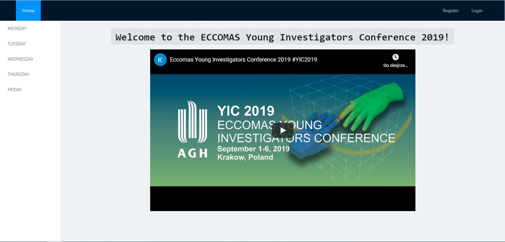
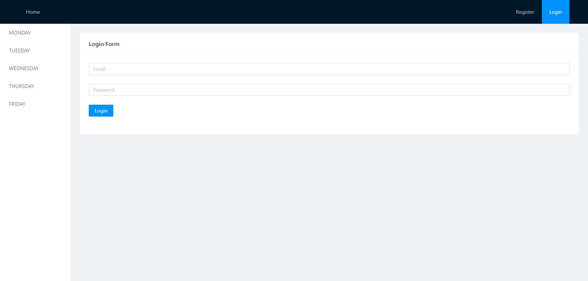
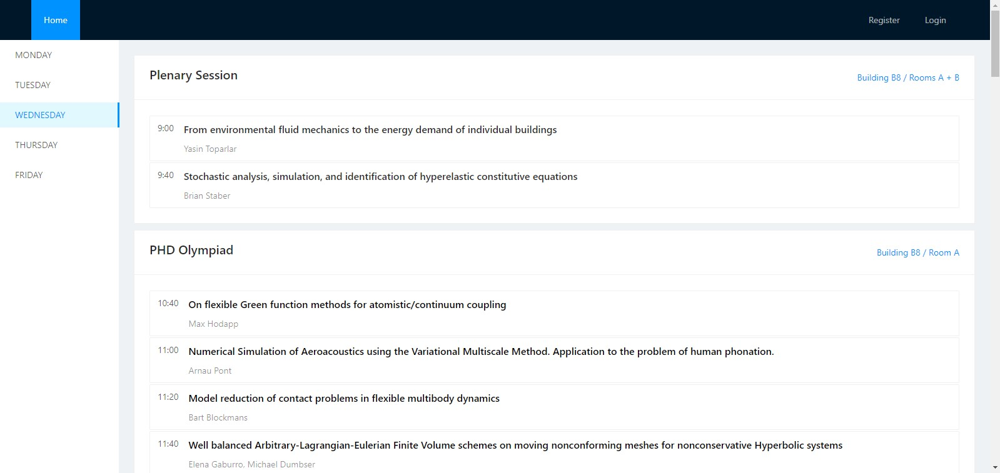
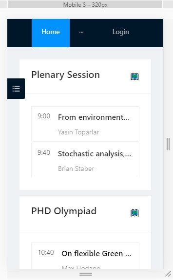

# ConferenceTimetable

ConferenceTimetable is a Single Page Application created for REST API which is made available by the university. It presents the schedule of ECCOMAS Young Investigators Conference 2019.



## Technologies

Project is created with:
* react@16.13.1
* axios@0.19.2
* antd@4.2.4
* react-router-dom@5.1.2


## Getting started

To get the frontend running locally:

```bash
git clone https://github.com/maciekpykosz/ConferenceTimetable.git
cd ConferenceTimetable
npm install 
npm start
```

## Application appearance

* Login Form

  

* Schedule
  
  

* Responsive

  